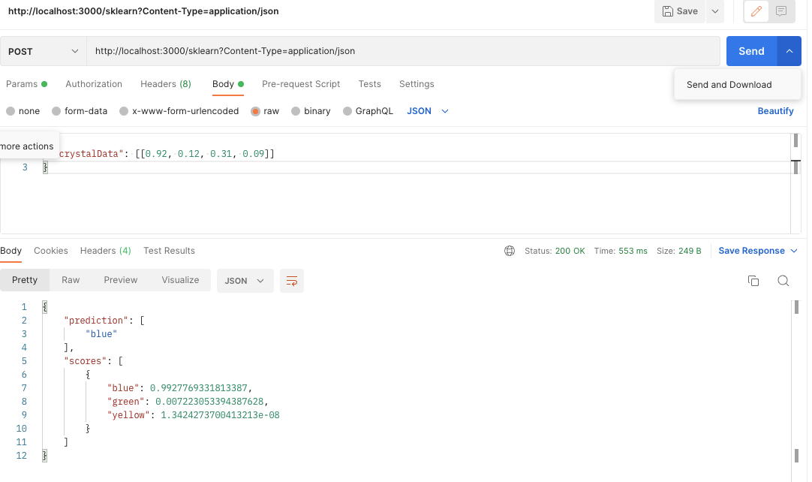
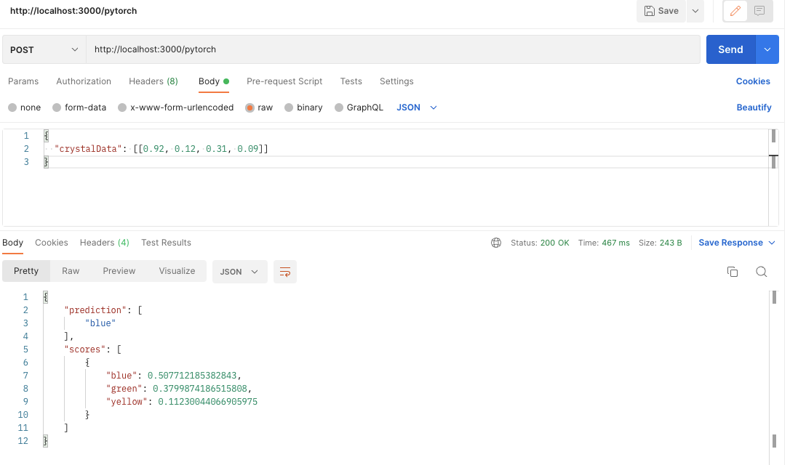
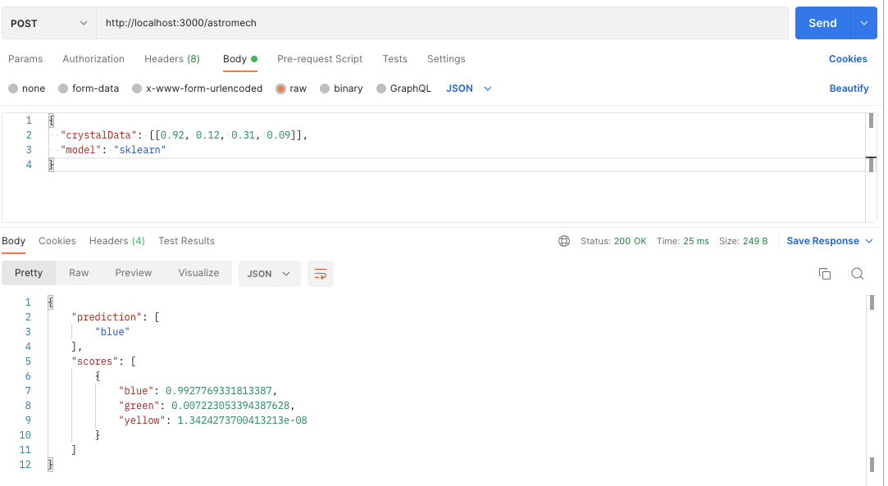

# Seedtag Codetest: MLOps Solution

## Overview

This document provides the solution to the Seedtag Codetest: MLOps. The solution involves creating a REST API using Flask that serves two machine learning models (Scikit-Learn and PyTorch) for analyzing Kyber Crystals. The API includes endpoints for making predictions using these models and handles both single and batch predictions.

## Project Structure

The project is organized into the following structure:

- **src/**: Contains the main application code.
  - **app.py**: The Flask application that defines the API endpoints.
  - **models/**: Contains the model files and the code to load and use the models.
    - **pytorch_classifier.py**: Defines the PyTorch model and the classifier class.
    - **sklearn_classifier.py**: Defines the Scikit-Learn classifier class.
    - **sklearn_model.pkl**: The saved Scikit-Learn model.
    - **pytorch_model.pth**: The saved PyTorch model.
  - **utils.py**: Contains utility functions for loading labels, validating input, and formatting the response.
- **tests/**: Contains the test files.
  - **test_app.py**: Unit tests for the Flask application.
  - **test_service.py**: Integration tests for the API endpoints.
- **requirements.txt**: Lists the required Python packages.
- **README.md**: Provides an overview of the project and instructions for running the application.

## Solution Details

### 1. Flask Application (`app.py`)

The Flask application provides three endpoints: `/sklearn`, `/pytorch`, and `/astromech`. Each endpoint handles POST requests with JSON payloads containing crystal data and returns predictions and scores for each label.

#### Endpoints

- **/sklearn**: Handles requests for the Scikit-Learn model.
- **/pytorch**: Handles requests for the PyTorch model.
- **/astromech**: Handles requests for either the Scikit-Learn or PyTorch model based on the `model` key in the request payload.

### 2. Models

#### PyTorch Classifier (`pytorch_classifier.py`)

The PyTorch classifier defines a simple neural network model for classification. The model is loaded from a saved state dictionary, and predictions are made using the `predict` method.

#### Scikit-Learn Classifier (`sklearn_classifier.py`)

The Scikit-Learn classifier loads a pre-trained model from a pickle file and uses the `predict_proba` method to make predictions.

### 3. Utility Functions (`utils.py`)

The utility functions include:

- **load_labels**: Reads the labels from a file and returns them as a list.
- **validate_input**: Validates the input data to ensure it contains the key `crystalData` and that the data is in the correct format.
- **format_response**: Formats the model predictions and scores into a dictionary with the appropriate structure for the response.

### 4. Tests

The solution includes comprehensive unit and integration tests to ensure correctness.

#### Unit Tests (`test_app.py`)

The unit tests verify the functionality of the Flask application by testing the API endpoints with various inputs. The tests include:

- **test_sklearn_endpoint**: Tests the `/sklearn` endpoint with valid input.
- **test_pytorch_endpoint**: Tests the `/pytorch` endpoint with valid input.
- **test_astromech_endpoint_sklearn**: Tests the `/astromech` endpoint with the `sklearn` model.
- **test_astromech_endpoint_pytorch**: Tests the `/astromech` endpoint with the `pytorch` model.
- **test_invalid_input_sklearn**: Tests the `/sklearn` endpoint with invalid input.
- **test_invalid_input_pytorch**: Tests the `/pytorch` endpoint with invalid input.
- **test_invalid_input_astromech**: Tests the `/astromech` endpoint with invalid input.
- **test_invalid_model_astromech**: Tests the `/astromech` endpoint with an invalid model type.

#### Integration Tests (`test_service.py`)

The integration tests verify the functionality of the API endpoints by making HTTP requests to the running Flask application. The tests include:

- **test_successful_single_sklearn_response**: Tests the `/sklearn` endpoint with a single valid input.
- **test_successful_batch_sklearn_response**: Tests the `/sklearn` endpoint with batch valid inputs.
- **test_successful_single_pytorch_response**: Tests the `/pytorch` endpoint with a single valid input.
- **test_successful_batch_pytorch_response**: Tests the `/pytorch` endpoint with batch valid inputs.
- **test_successful_astromech_response**: Tests the `/astromech` endpoint with a valid input and the `pytorch` model.
- **test_invalid_astromech_model**: Tests the `/astromech` endpoint with an invalid model type.
- **test_invalid_input_data**: Tests the `/sklearn` endpoint with invalid input data.

### Running the Application

To run the application, follow these steps:

1. **Install the required libraries**:
    ```bash
    pip install -r requirements.txt
    ```

2. **Run the Flask application**:
    ```bash
    python src/app.py
    ```

3. **Run the tests**:
    ```bash
    pytest tests/
    ```

### Calls for test the Solution

In the following screenshots see a few examples of calls:

- **sklearn**:



- **pytorch**:



- **astromech**:



### Conclusion

This solution provides a REST API for analyzing Kyber Crystals using Scikit-Learn and PyTorch models. The API handles both single and batch predictions and includes comprehensive unit and integration tests to ensure correctness. The code is structured to be easy to maintain and upgrade, following best practices in object-oriented programming and clean code.